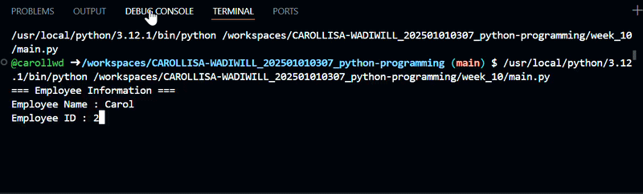

# Week 10 Tutorial

## HR Salary Calculator

This project is divided into 4 Python modules.

1. employee.py - Collect employee information.
2. salary.py - Calculate gross salary, EPF, SOCSO, and Net Salary
3. report.py - Display salary report.
4. main.py - Coordinate the whole program.

Additional Features:
- Overtime payment = RM25 per hour.
- Employees with more than 3 years of service receive RM500 reward.

## Tech Stack

1. Programming Language - Python
2. IDE & Repository Hosting - GitHub
3. Operating System - Windows

## Demonstration

