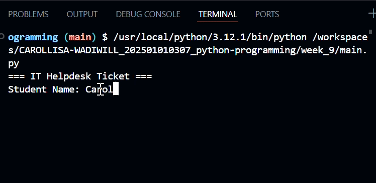

# Ticket Registration System

## Purpose of the Application

The Ticket Registration System allows students to register IT Support tickets. The system will collect student information, issue details, location and priority level before assigning technicians based on the situation. 

## Tech Stack

1. Programming Language: Python
2. IDE: GitHub
3. Modules Used:
  - `main.py`
  - `ticket.py`
  - `display.py`

## How to Use

1. Open the project folder in GitHub.
2. Open the terminal.
3. Run the program using:

```bash
python main.py
```

4. Enter the following information when the project runs.
   - Student Name
   - Student ID
   - Issue
   - Location
   - Priority (High/Medium/Low)

5. The system will:
   - Assign a technician based on the selected priority.
   - Set the ticket status to **Pending**.
   - Display the completed helpdesk ticket.

### Technician Assignment

| Priority | Technician |
|----------|------------|
| High | Ahmad |
| Medium | Siti |
| Low | Ali |


## Demonstration
